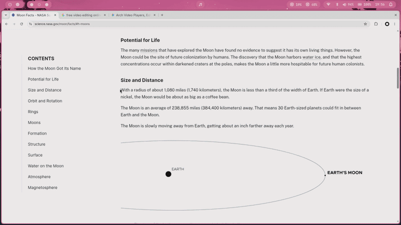

# ScholarLens

ScholarLens is an open-source browser extension that lets you fact-check text directly from any webpage. Select a claim, launch ScholarLens, and get a concise assessment backed by web sources.

> **Early-stage project:** ScholarLens is actively being developed. It is not yet published on the Chrome Web Store or Firefox Add-ons.

When reading an article, social media post, blog, or any other webpage, you may come across a statement you are not sure about.

Instead of opening another tab, searching for the claim manually, and comparing several results, ScholarLens lets you check it directly where you found it.

**Select the text, check it, and review the sources.**

## Features

### Fact-check any webpage

Select a claim on a webpage and use the ScholarLens action that appears next to your selection.

The result is displayed directly on the page, so there is no need to leave what you are reading.

## Demo



### Multiple languages

Fact-check results are currently available in:

* English
* French
* Spanish
* German

### Sources

Each fact-check includes the web sources used during the assessment, allowing you to open them and verify the information yourself.

### Export results

Fact-check results can be exported as a PDF for later reference or sharing.

### Copy citations

A fact-check can be copied to the clipboard as a compact citation containing the claim, verdict, confidence score, and source URLs.


## Important limitations

ScholarLens is a fact-checking assistant, not a definitive source of truth.

Search results can be incomplete, sources can disagree, and the generated assessment can sometimes be incorrect. A high confidence score does not guarantee that a claim is correct.

For important or sensitive decisions, always open and review the cited sources yourself.

ScholarLens is intended to help users **investigate claims faster**, not replace critical thinking or primary-source verification.

## Browser support

ScholarLens is built with WXT and is intended to support Chromium-based browsers and Firefox.

| Browser                 | Availability          |
| ----------------------- | --------------------- |
| Chrome                  | Coming soon           |
| Firefox                 | Coming soon           |
| Edge                    | Expected to work      |
| Other Chromium browsers | Not officially tested |

The Chrome Web Store and Firefox Add-ons releases will be announced when they become available.

## Installation

### Browser stores

Store installation is not available yet.

Official installation links will be added here once the extensions are published:

* Chrome Web Store — coming soon
* Firefox Add-ons — coming soon

### Install from source

Until the store releases are available, ScholarLens can be built and loaded locally.

#### Requirements

* Node.js
* pnpm
* A Chromium-based browser or Firefox

#### Clone the repository

```bash
git clone https://github.com/ttmassa/scholarlens.git
cd scholarlens
```

#### Install dependencies

```bash
cd wxt
pnpm install
```

#### Start the development build

For Chromium:

```bash
pnpm dev
```

For Firefox:

```bash
pnpm dev:firefox
```

#### Create a production build

For Chromium:

```bash
pnpm build
```

For Firefox:

```bash
pnpm build:firefox
```

These commands are primarily intended for contributors and developers.

## Privacy

ScholarLens needs access to the text selected by the user in order to fact-check it.

Selected text is sent to the ScholarLens backend for processing. The backend uses third-party services to retrieve web sources and generate the fact-check.

ScholarLens currently uses:

* **Cloudflare Workers and KV** for its backend and caching
* **Brave Search** for web search
* **Google Gemini** for analysis

The extension does not contain the third-party API credentials.

The current implementation limits submitted claims to 1,000 characters and applies backend rate limiting.

A dedicated privacy policy will be provided as part of the browser-store publication process.

## Contributing and feedback

Contributions, bug reports, feature requests, and general feedback are welcome.

Before opening an issue or pull request:

1. Check whether the topic has already been reported or discussed.
2. Make sure you are using the latest version.
3. Clearly describe the problem, idea, or proposed change.
4. Include reproduction steps for bugs when possible.
5. Include relevant browser information, console errors, or screenshots when useful.
6. Do not include private or sensitive webpage content.

For larger changes, opening an issue before starting implementation is recommended so the approach can be discussed first.

[Open an issue or share feedback on GitHub](https://github.com/ttmassa/scholarlens/issues)

Pull requests are welcome for bug fixes, improvements, documentation, and new features.

## License

This project is open source.

See the repository's `LICENSE` file for the applicable license and terms.